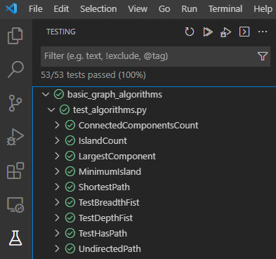

<div align="center">
  
  <h1 style="margin-bottom:40px; margin-top:20px">Graphs are Awesome
</h1>
</div>

<div id="top"></div>

[](https://opensource.org/licenses/MIT)
[](https://www.python.org/)

Graph theory goes back to the XVIII century, when Euler introduced its basic ideas to solve the famous problem of the Kronigsberg’s bridges. However, in the last few decades, graph theory has been established, by its own right, as an important mathematical tool in a wide variety of areas of knowledge, such as operational research, engineering, genetics, sociology, geography, ecology, numerical analysis, parallel computation, telecommunications and chemistry. Besides, it is usual to say that a considerable number of problems in a wide variety of sciences can be modeled by a graph and solved using graph theory. For example, it is possible to calculate the different combinations of flights between two cities, to determinate if it is possible or not to walk in every street of a city without walking in a street twice and to know the number of colours we need to colour a map.

---

<h2 style="margin-top:40px"><a href="algorithms/README.md">Blog Content</a></h2>

1. Graph Theory Intro
2. Graph Neural Networks

---

<h2 style="margin-top:40px"><a href="algorithms/README.md">Basic Graph Algorithms</a></h2>

* Breadth First
* Depth First
* Has Path
* Undirected Path
* Connected Components Count
* Largest Component
* Shortest Path
* Island Count
* Minimum Island


```
> python -m unittest discover

----------------------------------------------------------------------
Ran 53 tests in 0.009s

OK
```

```
> pytest

==================== test session starts ==================== 
platform win32 -- Python 3.8.8, pytest-6.2.3, py-1.10.0, pluggy-0.13.1
rootdir: C:\repos\basic_graph_algorithms
plugins: anyio-2.2.0
collected 53 items

test_algorithms.py ............................................ [100%] 

==================== warnings summary ======================= 
..\..\Users\vitor.pereira\Anaconda3\lib\site-packages\pyreadline\py3k_compat.py:8
  C:\Users\vitor.pereira\Anaconda3\lib\site-packages\pyreadline\py3k_compat.py:8: DeprecationWarning: Using or importing the ABCs from 'collections' instead of from 'collections.abc' is deprecated 
since Python 3.3, and in 3.9 it will stop working
    return isinstance(x, collections.Callable)

-- Docs: https://docs.pytest.org/en/stable/warnings.html
==================== 53 passed, 1 warning in 0.52s ==========
```




---

<h2 style="margin-top:40px"><a href="graph/README.md">Graph</a></h2>

```python
while True:
    pass
```

---

<h2 style="margin-top:40px">Contributing</h2>

Contributions are **greatly appreciated**. If you want to help us improve this software, please fork the repo and create a new pull request. Don't forget to give the project a star! Thanks!

1. Fork the Project
2. Create your Feature Branch (`git checkout -b feature/AmazingFeature`)
3. Commit your Changes (`git commit -m 'Add some AmazingFeature'`)
4. Push to the Branch (`git push origin feature/AmazingFeature`)
5. Open a Pull Request

Alternatively, you can make suggestions or report bugs by opening a new issue with the appropriate tag ("feature" or "bug") and following our Contributing template.

---

<h2 style="margin-top:40px">License</h2>

Distributed under the MIT License. See `LICENSE.txt` for more information.

---

<h2 style="margin-top:40px">References</h2>

+ [Kipf and Welling, 2017]  Semi-supervised Classification with Graph Convolutional Networks
+ [Liang Yao, Chengsheng Mao, Yuan Luo, 2018] Graph Convolutional Networks for Text Classification


<p style="margin-bottom:20px; margin-top:40px" align="right">(<a href="#top">back to top</a>)</p>
